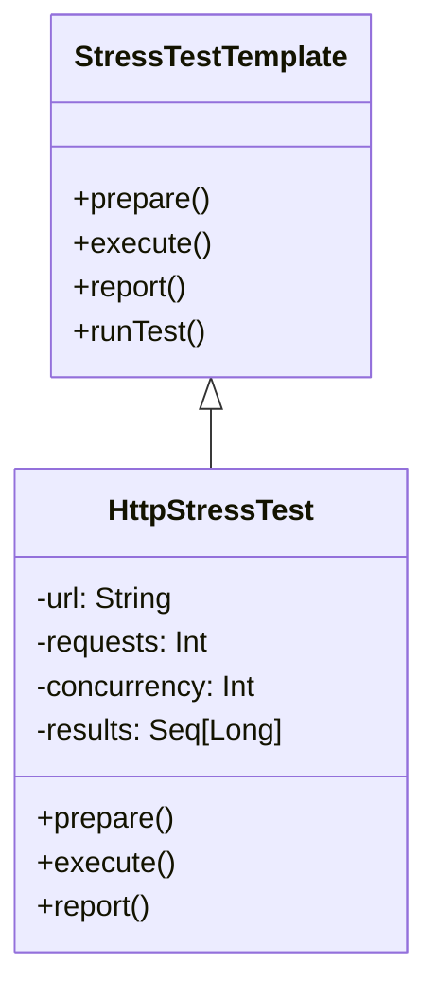

# **HTTP Stress Test Framework**

## Overview

This project implements a stress test framework for HTTP endpoints. It allows users to configure the number of requests, concurrency level, and target URL to evaluate the performance and reliability of HTTP services under load. The solution utilizes the Template Method Pattern to structure the stress test workflow, ensuring extensibility and clear separation of preparation, execution, and reporting phases.

---

## Tech Stack

- **Language** -> Scala 3
- **Build Tool** -> sbt
- **Testing** -> ScalaTest 3.2.16
- **JDK** -> 25

---

## Architecture Diagram


```mermaid
classDiagram
    direction TB

    class StressTestTemplate {
        +prepare()
        +execute()
        +report()
        +runTest()
    }

    class HttpStressTest {
        -url: String
        -requests: Int
        -concurrency: Int
        -results: Seq[Long]
        +prepare()
        +execute()
        +report()
    }

    StressTestTemplate <|-- HttpStressTest
```

---

## Setup Instructions

### 1 - Clone

```bash
git clone https://github.com/rbleggi/tech-pocs.git
cd scala-3/stress-test-http-framework
```

### 2 - Build

```bash
sbt compile
```

### 3 - Test

```bash
sbt test
```
