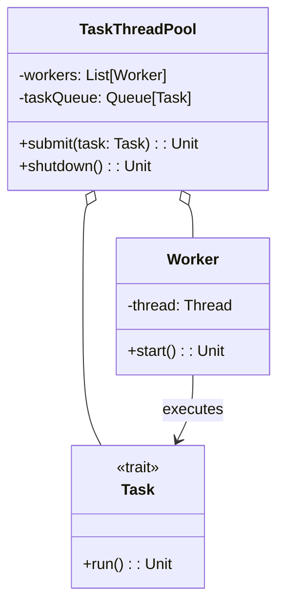

# **Task ThreadPool Framework**

## **Overview**

A modular Scala 3 PoC for concurrent task execution using a custom thread pool, inspired by the class-organizer and social-media-photo-app project standards. Demonstrates core features (task submission, thread pool management, graceful shutdown) and extensibility for real-world concurrent workloads.

### **Tech Stack**

- **Scala 3** → Modern JVM-based language with functional programming support.
- **SBT** → Scala's official build tool.
- **JDK 21** → Required to run the application.

---

## **Features**

- **Task Submission** → Submit tasks for concurrent execution
- **Thread Pool Management** → Custom thread pool with configurable workers
- **Graceful Shutdown** → Safe pool shutdown and task completion
- **Simple API** → Minimal, extensible interface for real-world use
- **Easily Extensible** → Add new task types or pool strategies without changing core logic

---

## **Architecture Diagram**



---

## **Thread Pool Pattern**

The **Thread Pool Pattern** enables efficient, reusable management of concurrent tasks. Tasks are submitted to a queue and executed by a fixed set of worker threads, improving resource usage and throughput for parallel workloads.

---

## **Setup Instructions**

### **1️ - Clone the Repository**

```bash
git clone https://github.com/rbleggi/tech-pocs.git
cd scala-3/task-threadpool
```

### **2️ - Compile & Run the Application**

```bash
./sbtw compile run
```

### **3️ - Run Tests**

```bash
./sbtw test
```
