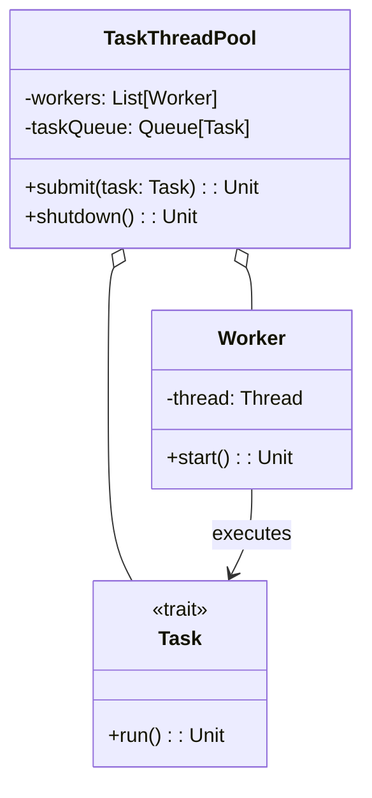

# **Task ThreadPool Framework**

## Overview

A modular Scala 3 PoC for concurrent task execution using a custom thread pool. Demonstrates core features (task submission, thread pool management, graceful shutdown) and extensibility for real-world concurrent workloads.

---

## Tech Stack

- **Language** -> Scala 3
- **Build Tool** -> sbt
- **Testing** -> ScalaTest 3.2.16
- **JDK** -> 25

---

## Architecture Diagram


```mermaid
classDiagram
    direction TB

    class Task {
        <<trait>>
        +run(): Unit
    }

    class TaskThreadPool {
        -workers: List[Worker]
        -taskQueue: Queue[Task]
        +submit(task: Task): Unit
        +shutdown(): Unit
    }

    class Worker {
        -thread: Thread
        +start(): Unit
    }

    TaskThreadPool o-- Worker
    TaskThreadPool o-- Task
    Worker --> Task : executes
```

---

## Setup Instructions

### 1 - Clone

```bash
git clone https://github.com/rbleggi/tech-pocs.git
cd scala-3/task-threadpool
```

### 2 - Build

```bash
sbt compile
```

### 3 - Test

```bash
sbt test
```
