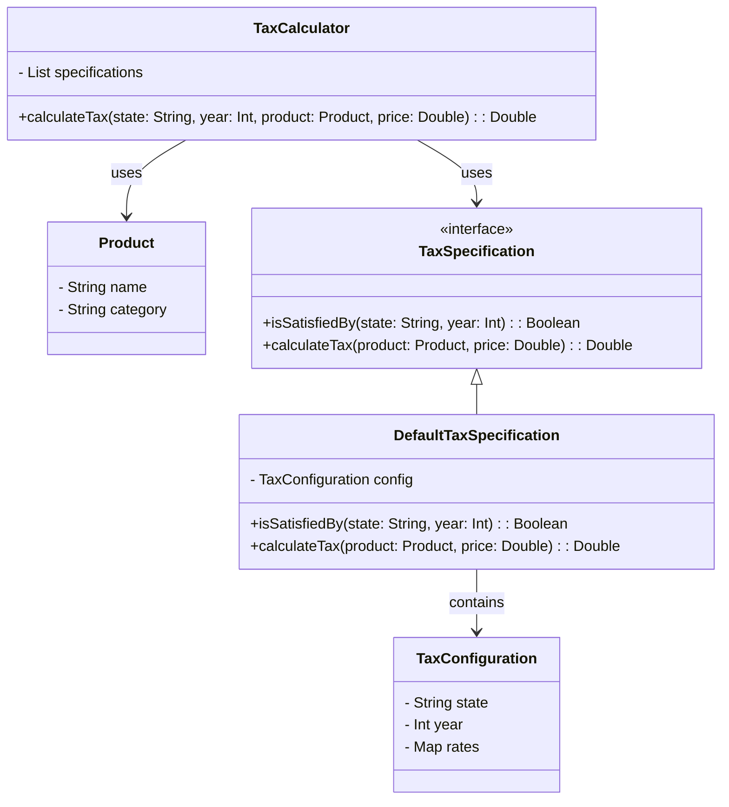

# **TAX System**

## **Overview**

This project demonstrates a **dynamic tax calculation system** where different products are subject to **varying tax rates** based on **state and year**. The system follows the **Specification Pattern**, ensuring that tax rules are **modular, extensible, and easily adaptable** to changes.

---

## **Tech Stack**

- **Scala 3** → Modern JVM-based language with advanced type safety and functional programming features.
- **SBT** → Scala's official build tool.
- **JDK 21** → Required to run the application.

---

## **Features**
- **Product-based Taxation** → Different products have distinct tax rates.  
- **State-Specific Taxes** → Each state defines its own tax rules.  
- **Yearly Tax Updates** → Tax rates change depending on the year.  
- **Specification Pattern** → Decouples tax rules from business logic.  
- **Encapsulation** → Each tax rule is **self-contained**, making the system easy to extend.

---

## **Architecture Diagram**



---

## **Specification Pattern**
The **Specification Pattern** is used to **encapsulate business rules** for tax calculations. Instead of hardcoding tax logic in a central place, the system:
-  **Uses `TaxSpecification` as an interface** defining the tax contract.
-  **Implements `DefaultTaxSpecification`** for dynamically applying the correct tax rule.
-  **Delegates tax calculation responsibility to each specification**, ensuring that **business rules remain encapsulated**.

---

## **Setup Instructions**

### **1️ - Clone the Repository**
```shell
git clone https://github.com/rbleggi/tech-pocs.git
cd scala-3/tax-system
```

### **2️ - Compile & Run the Application**
```shell
./sbtw compile run
```

### **3️ - Run Tests**
```shell
./sbtw compile test
```