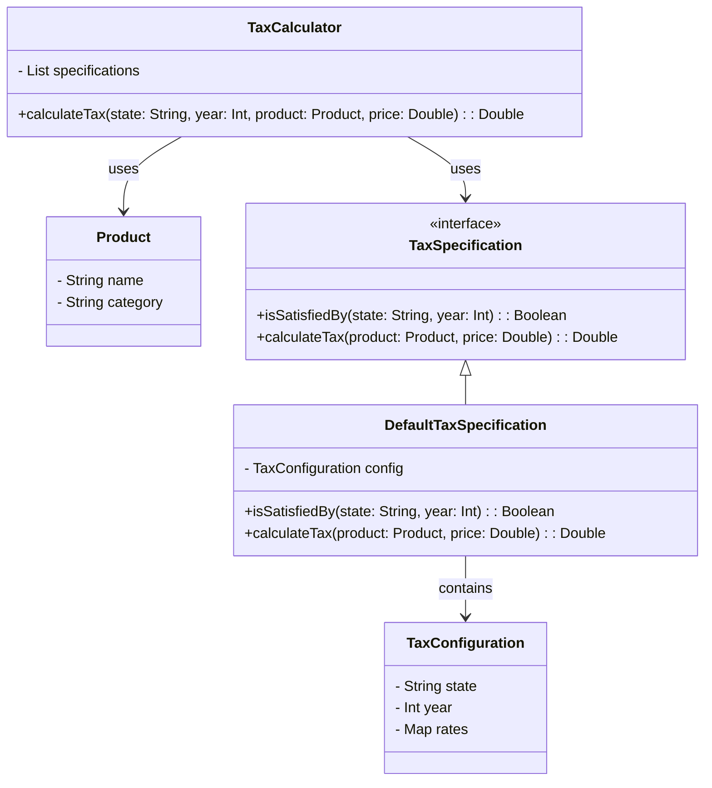

# **Tax System**

## Overview

This project demonstrates a dynamic tax calculation system where different products are subject to varying tax rates based on state and year. The system follows the Specification Pattern, ensuring that tax rules are modular, extensible, and easily adaptable to changes.

---

## Tech Stack

- **Language** -> Scala 3
- **Build Tool** -> sbt
- **Testing** -> ScalaTest 3.2.16
- **JDK** -> 25

---

## Architecture Diagram


```mermaid
classDiagram
   direction TB

   class Product {
      - String name
      - String category
   }

   class TaxConfiguration {
      - String state
      - Int year
      - Map<String, Double> rates
   }

   class TaxSpecification {
      <<interface>>
      +isSatisfiedBy(state: String, year: Int): Boolean
      +calculateTax(product: Product, price: Double): Double
   }

   class DefaultTaxSpecification {
      - TaxConfiguration config
      +isSatisfiedBy(state: String, year: Int): Boolean
      +calculateTax(product: Product, price: Double): Double
   }

   class TaxCalculator {
      - List<TaxSpecification> specifications
      +calculateTax(state: String, year: Int, product: Product, price: Double): Double
   }

   TaxSpecification <|-- DefaultTaxSpecification
   TaxCalculator --> TaxSpecification : uses
   TaxCalculator --> Product : uses
   DefaultTaxSpecification --> TaxConfiguration : contains
```

---

## Setup Instructions

### 1 - Clone

```bash
git clone https://github.com/rbleggi/tech-pocs.git
cd scala-3/tax-system
```

### 2 - Build

```bash
sbt compile
```

### 3 - Test

```bash
sbt test
```
