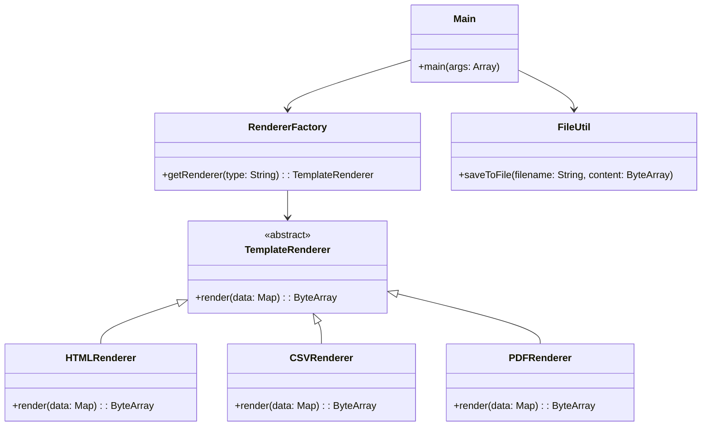

# **Template Renderer**

## Overview

This project follows an **Object-Oriented Design (OOP)** approach to generate templates in **HTML, CSV, and PDF** formats. It uses:

---

## **Tech Stack**

- **Scala 3** → Modern JVM-based language with advanced type safety and functional programming features.
- **SBT** → Scala's official build tool.
- **JDK 21** → Required to run the application.
- **iText** → A library for PDF generation.

---

## Features

- **HTML Rendering** → Generates HTML files.  
- **CSV Rendering** → Generates CSV files.  
- **PDF Rendering** → Uses iText for generating PDF files.  
- **Factory Pattern** → Dynamically selects the correct renderer.  
- **Encapsulation & Polymorphism** → Each renderer extends the base `TemplateRenderer` class.  

---

## Architecture Diagram



### **Explanation**
- **TemplateRenderer** (Abstract Class) → Base class for all renderers.
- **HTMLRenderer, CSVRenderer, PDFRenderer** → Implement `render()` differently based on the file format.
- **RendererFactory** → Implements the **Factory Pattern** to return the correct renderer.

---

## Setup Instructions

### **1️ - Clone the Repository**
```shell
git clone https://github.com/rbleggi/tech-pocs.git
cd scala-3/template-renderer
```

### **2️ - Compile & Run the Application**
```shell
./sbtw compile run
```

### **3️ - Run Tests**
```shell
./sbtw compile test
```