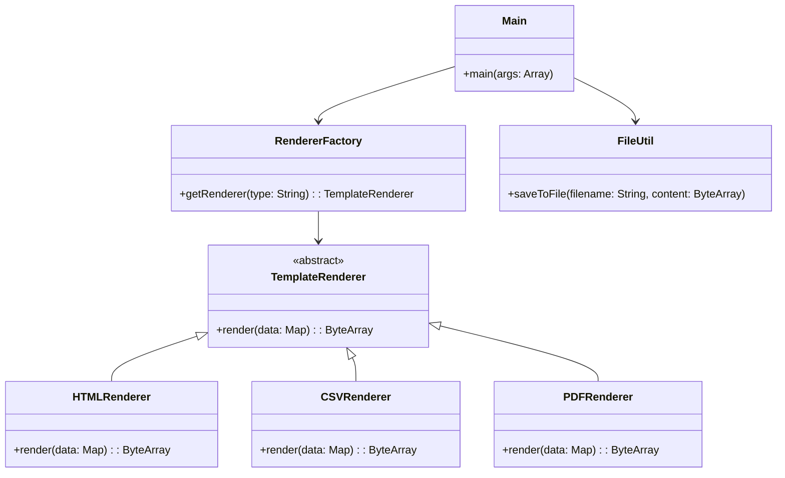

# **Template Renderer**

## Overview

This project follows an Object-Oriented Design approach to generate templates in HTML, CSV, and PDF formats using the Factory Pattern. Each renderer extends the base TemplateRenderer class, and RendererFactory dynamically selects the correct renderer.

---

## Tech Stack

- **Language** -> Scala 3
- **Build Tool** -> sbt
- **Testing** -> ScalaTest 3.2.16
- **JDK** -> 25
- **iText** -> PDF generation library

---

## Architecture Diagram


```mermaid
classDiagram
   class TemplateRenderer {
      <<abstract>>
      +render(data: Map<String, String>): ByteArray
   }

   class HTMLRenderer {
      +render(data: Map<String, String>): ByteArray
   }

   class CSVRenderer {
      +render(data: Map<String, String>): ByteArray
   }

   class PDFRenderer {
      +render(data: Map<String, String>): ByteArray
   }

   class RendererFactory {
      +getRenderer(type: String): TemplateRenderer
   }

   class FileUtil {
      +saveToFile(filename: String, content: ByteArray)
   }

   class Main {
      +main(args: Array<String>)
   }

   TemplateRenderer <|-- HTMLRenderer
   TemplateRenderer <|-- CSVRenderer
   TemplateRenderer <|-- PDFRenderer
   RendererFactory --> TemplateRenderer
   Main --> RendererFactory
   Main --> FileUtil
```

---

## Setup Instructions

### 1 - Clone

```bash
git clone https://github.com/rbleggi/tech-pocs.git
cd scala-3/template-renderer
```

### 2 - Build

```bash
sbt compile
```

### 3 - Test

```bash
sbt test
```
