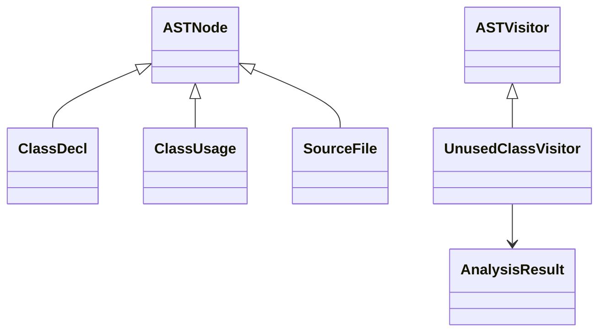

# **Unused Class Detector**

## **Overview**

Detects unused Scala classes in source files. The program reads the file, analyzes class declarations and usages, and prints unused classes to the console.

---

## **Tech Stack**

- **Scala 3** → Modern JVM-based language with advanced typing and functional programming features.
- **SBT** → Official build tool for Scala.
- **JDK 21** → Required to run the application.

---

## **Features**

- Detects unused Scala classes in source files.
- Reads the source file and analyzes it using regular expressions.
- Simple console report listing unused classes.
- Minimal interface: just run the program to get results.
- **Visitor Pattern**: Analysis is performed by a visitor (UnusedClassVisitor) traversing a simplified AST.

---

## **Architecture Diagram**



---

## **Design Pattern Used**

- Visitor Pattern: The UnusedClassVisitor implements the analysis logic by traversing the simplified AST.

---

## **Setup Instructions**

### **1️ - Clone the Repository**

```bash
git clone https://github.com/rbleggi/tech-pocs.git
cd scala-3/unused-class-detector
```

### **2️ - Compile & Run the Application**

```shell
./sbtw compile run
```

### **3️ - Run Tests**

```shell
./sbtw compile test
```