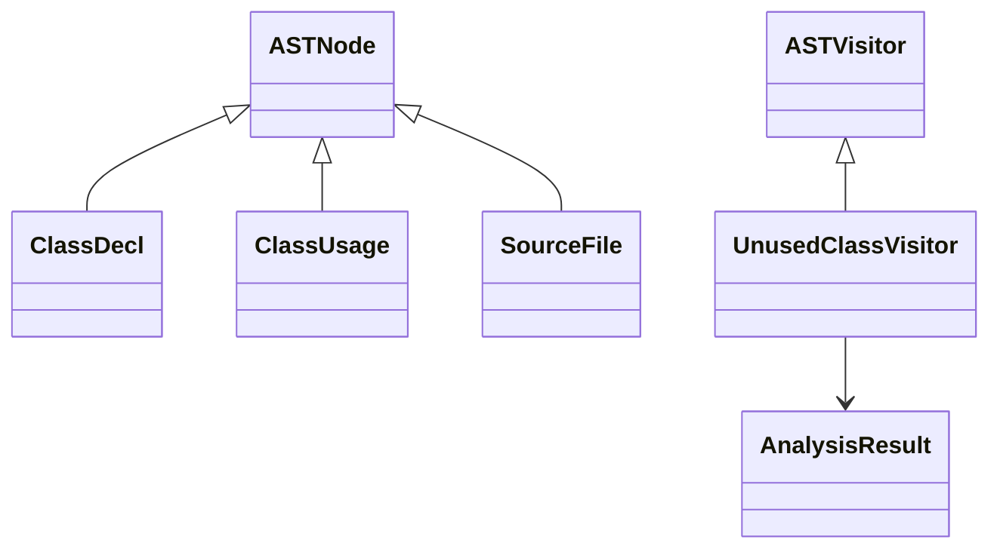

# **Unused Class Detector**

## Overview

Detects unused Scala classes in source files using the Visitor Pattern. The program reads the file, analyzes class declarations and usages via a simplified AST traversal, and prints unused classes to the console.

---

## Tech Stack

- **Language** -> Scala 3
- **Build Tool** -> sbt
- **Testing** -> ScalaTest 3.2.16
- **JDK** -> 25

---

## Architecture Diagram


```mermaid
classDiagram
    direction TB
    class ASTNode
    class ClassDecl
    class ClassUsage
    class SourceFile
    class ASTVisitor
    class UnusedClassVisitor
    class AnalysisResult

    ASTVisitor <|-- UnusedClassVisitor
    ASTNode <|-- ClassDecl
    ASTNode <|-- ClassUsage
    ASTNode <|-- SourceFile
    UnusedClassVisitor --> AnalysisResult
```

---

## Setup Instructions

### 1 - Clone

```bash
git clone https://github.com/rbleggi/tech-pocs.git
cd scala-3/unused-class-detector
```

### 2 - Build

```bash
sbt compile
```

### 3 - Test

```bash
sbt test
```
