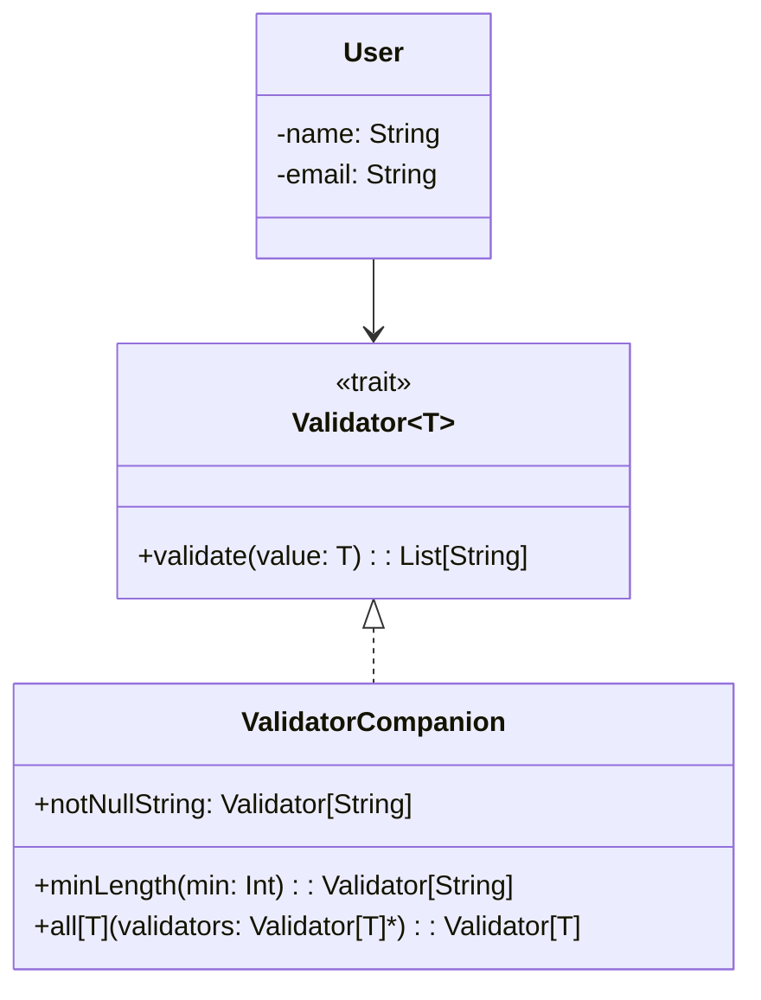

# **Validation Framework**

## **Overview**

This project implements a simple and extensible validation framework using the Strategy Pattern in Scala. It allows developers to define reusable validators and compose them to validate case class fields.

### **Tech Stack**

- **Scala 3.3.1** → Modern JVM-based language with functional programming support.
- **SBT** → Scala's official build tool.
- **JDK 21** → Required to run the application.

---

## **Features**

- **Composable Validators** → Combine multiple validators for a single field.
- **Strategy Pattern** → Easily add new validation strategies by implementing the Validator trait.
- **Manual Composition** → Explicitly compose validators for each case class.
- **Extensible** → Add new validators without changing the framework core.

---

## **Architecture Diagram**



---

## **Implementation Details**

Validation is performed using the `Validator[T]` trait, which defines the method `validate(value: T): List[String]`. Concrete implementations of this trait are provided for specific types, such as `String` and `User`.

- The `Validator` object provides reusable validators like `notNullString` and `minLength`, as well as an `all` method to combine multiple validators.
- To validate a composite type (such as `User`), an implementation of `Validator[User]` is created that uses the appropriate field validators.
- There is no use of annotations, reflection, or dynamic strategy mapping. All validator composition is done manually and explicitly in the code.
- To validate an object, simply call `Validator[User].validate(user)` and check the returned list of error messages.

---

## **Setup Instructions**

### **1️ - Clone the Repository**

```bash
git clone https://github.com/rbleggi/tech-pocs.git
cd scala-3/validation-framework
```

### **2️ - Compile & Run the Application**

```bash
./sbtw compile run
```

### **3️ - Run Tests**

```bash
./sbtw test
```
