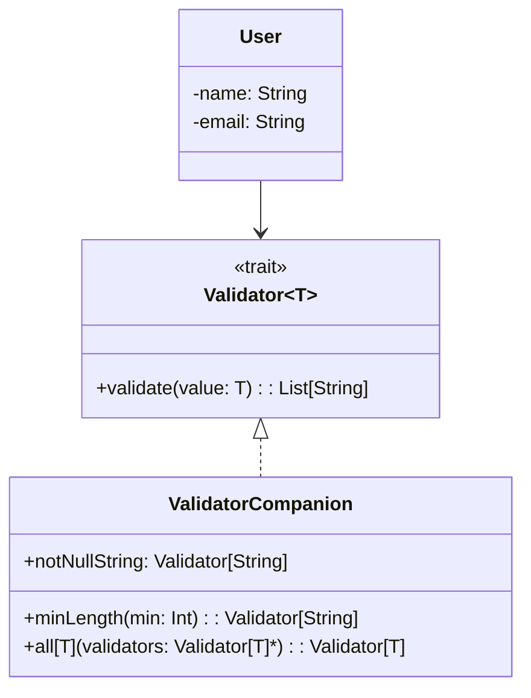

# **Validation Framework**

## Overview

This project implements a simple and extensible validation framework using the Strategy Pattern in Scala. It allows developers to define reusable validators and compose them to validate case class fields.

---

## Tech Stack

- **Language** -> Scala 3
- **Build Tool** -> sbt
- **Testing** -> ScalaTest 3.2.16
- **JDK** -> 25

---

## Architecture Diagram


```mermaid
classDiagram
    direction TB

    class Validator~T~ {
        <<trait>>
        +validate(value: T): List[String]
    }

    class User {
        -name: String
        -email: String
    }

    class ValidatorCompanion {
        +notNullString: Validator[String]
        +minLength(min: Int): Validator[String]
        +all[T](validators: Validator[T]*): Validator[T]
    }

    Validator~T~ <|.. ValidatorCompanion
    User --> Validator~T~
```

---

## Setup Instructions

### 1 - Clone

```bash
git clone https://github.com/rbleggi/tech-pocs.git
cd scala-3/validation-framework
```

### 2 - Build

```bash
sbt compile
```

### 3 - Test

```bash
sbt test
```
