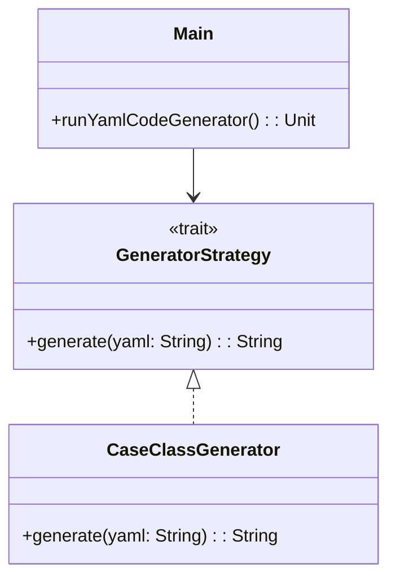

# YAML Code Generator

## Overview

This project implements a simple and extensible code generator based on YAML definitions using the Strategy Pattern in Scala. It allows developers to define reusable code generation strategies and compose them to generate code (e.g., Scala case classes) from YAML files.

---

## **Tech Stack**

- **Scala 3** → Modern JVM-based language with advanced type safety and functional programming features.
- **SBT** → Scala's official build tool.
- **JDK 21** → Required to run the application.

---

## Features
- **YAML-driven code generation**
- **Strategy Pattern**: Easily extend with new code generation strategies by implementing the `GeneratorStrategy` trait
- **Simple CLI**: Run the generator from the command line
- **Extensible**: Add new code generation strategies without changing the framework core

---

## Architecture Diagram



---

## Implementation Details

- The generator uses the `GeneratorStrategy` trait, which defines the method `generate(yaml: String): String`.
- Concrete implementations of this trait (e.g., `CaseClassGenerator`) generate code for specific targets (e.g., Scala case classes).
- The `Main` object reads a YAML file, selects a strategy, and prints the generated code.
- To add new code generation strategies, implement the `GeneratorStrategy` trait and update the Main to use your new strategy.

---

## **Setup Instructions**

### **1️ - Clone the Repository**

```bash
git clone https://github.com/rbleggi/tech-pocs.git
cd scala-3/yaml-code-generator
```

### **2️ - Compile & Run the Application**

```bash
./sbtw compile run
```

### **3️ - Run Tests**

```bash
./sbtw test
```
