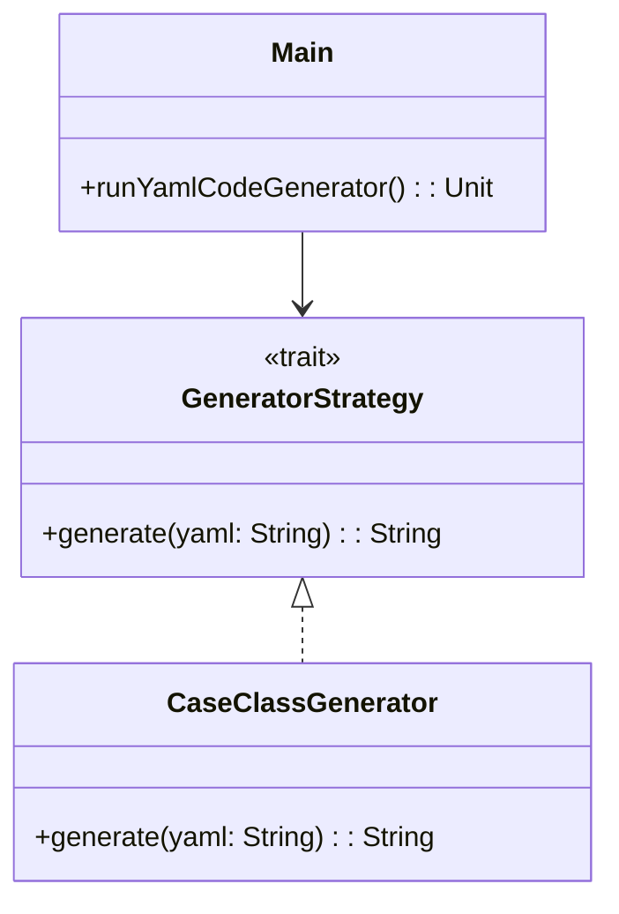

# **YAML Code Generator**

## Overview

This project implements a simple and extensible code generator based on YAML definitions using the Strategy Pattern in Scala. It allows developers to define reusable code generation strategies and compose them to generate code (e.g., Scala case classes) from YAML files.

---

## Tech Stack

- **Language** -> Scala 3
- **Build Tool** -> sbt
- **Testing** -> ScalaTest 3.2.16
- **JDK** -> 25

---

## Architecture Diagram


```mermaid
classDiagram
    direction TB

    class GeneratorStrategy {
        <<trait>>
        +generate(yaml: String): String
    }

    class CaseClassGenerator {
        +generate(yaml: String): String
    }

    class Main {
        +runYamlCodeGenerator(): Unit
    }

    GeneratorStrategy <|.. CaseClassGenerator
    Main --> GeneratorStrategy
```

---

## Setup Instructions

### 1 - Clone

```bash
git clone https://github.com/rbleggi/tech-pocs.git
cd scala-3/yaml-code-generator
```

### 2 - Build

```bash
sbt compile
```

### 3 - Test

```bash
sbt test
```
